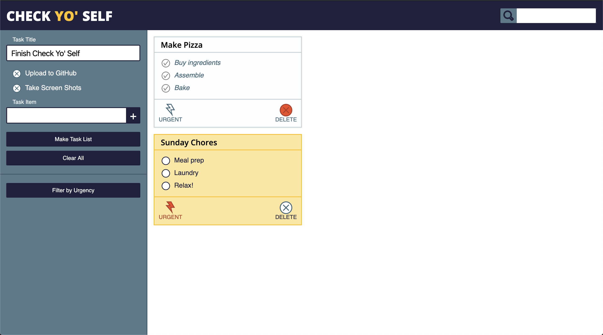

# Check Yo' Self
## Overview of Project and Goals
* Check Yo' Self is a webpage that allows the user to make and complete checklists. Users are able to filter by urgency and search for to-do lists using the search bar. The biggest goal for this project was to write Javascript code that is dry and to display what I've learned over the last six weeks in mod 1.

## Overview of Technologies Used, Challenges, and Wins
* This project was seemingly easy until I started to write the many functionalities needed. I felt like my code could be improved by making it more dry. I feel very good that I think I covered most corner cases in the functionality of the website. I wish I could have added the masonry layout. During this project, I helped many people with their thought processes before I had actually written my version of the code itself. In a way, I feel like this discussion with peers really helped my understanding of the code. I definitely was distracted by helping people, though.

## Screenshots

